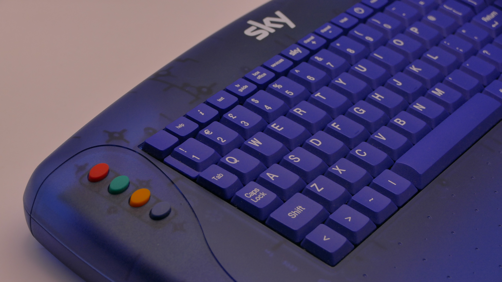

# SkyBoard ESP32 🛰️🧀  
Use an old Sky Digital IR keyboard... in the 2020s!

This ESP32-based project lets you resurrect that gloriously chunky **Sky Digital TV infrared keyboard**, turning it into a working **Bluetooth HID keyboard** for modern machines. It shows up just like any regular keyboard (no drivers needed), and yes — **it actually works** on Windows 11.

This project now supports the even rarer **Sky Digital Naviagator Remote** for some reason,  some of the key mappings aren't correct for this for symbols but most work fine - it's a janky old lump of dump anyway. You won't be coding or gaming on it.

### 🎮 Features

- ✅ Maps IR signals from the Sky remote/keyboard to real keystrokes  
- 🖱️ Arrow keys double as a painfully basic "mouse" (you’ll want to fix this)  
- ⏺️ `Select` button acts as **Left Mouse Click**  
- 🔵 Appears as a proper **Bluetooth HID device**  
- 🧪 Tested on Windows 11 and somehow functions

### 🧰 Requirements

- ESP32 dev board  
- IR receiver (e.g. **KY-022**)  
- Sky Digital keyboard / remote  
- PlatformIO + VS Code  
- A stubborn belief that this is a good idea

### 🚀 How to Use

1. Clone this repo  
2. Plug in your ESP32 and IR receiver  
3. Flash with PlatformIO  
4. Pair it with your Windows PC  
5. Laugh. Cry. Use the keyboard. Regret nothing.

### 🛠️ To Fix (Pull Requests Welcome!)

- Mouse movement is *very* janky — arrow key mapping is a stopgap  
- No right-click, scrolling, or pointer acceleration  
- Could use better debounce handling and mapping flexibility

---

SkyBoard: because the future is overrated and IR still works.  
